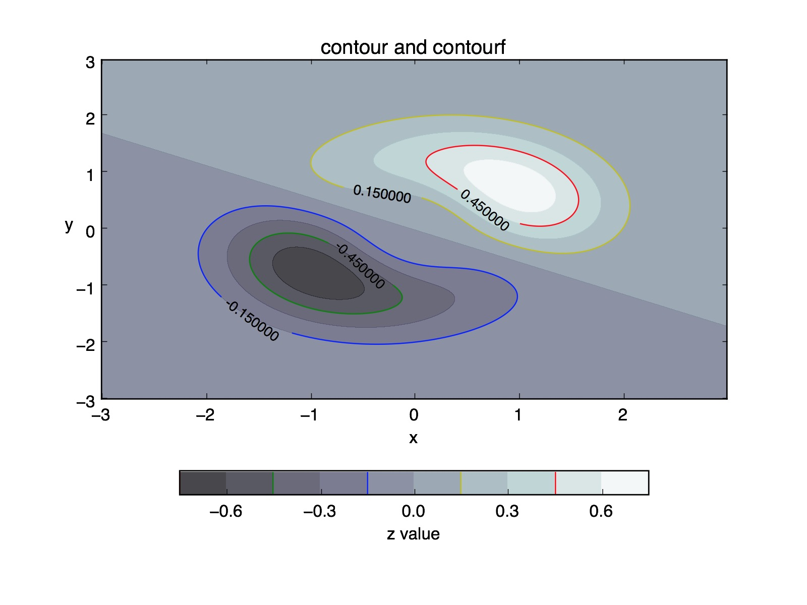

# Notes for Matplolib

# Intro

There are four privmative drawing objects in `matplotlib`:

- `Line2D`: this object is used to present a 2D line on the graph or any other curves that can be Bezier-approximated.
- `AxesImage`: this object takes a 2D data and interprete it as densities with a colormap. This is usually returned by the `imshow` method.
- `Patch`: It represent a 2D object that has a single colored "face". This object must have "path" which is much like a Line2D object enclosing a a face to filled with that color.
- `Text`: It represent the text in a graph such as legends, labels,...etc. It takes a string, coordinates and font parameters to instantiate this object.

Any sophisticated plots in matplotlib are build upon these four objects. In the following notes, I will mostly use these four objects to plot all the graph. See the python scripts in `challenges` directory for more advanced examples.

Switch to `interative` branch to see how to write interative matplotlib applications.

# 2D Graph

## Basic Ploting

```{python}
import matplotlib.pyplot as plt
import numpy as np

x = np.linspace(0, np.pi, 1000)
y = np.sin(x)

fig1, ax1 = plt.subplots(nrows = 1, ncols = 1) # A single plot figure.
ax1.plot(x, y, c = 'b', ls = '--') 
# `c` for color, `ls` for line shape. '--' is dashed line, '*' is start,...etc.

fig2, axs = plt.subplots(nrows = 2, ncols = 1) # A 2x1 plots.
## Note that `axs` (or `ax`) can be an array of Axe objects or a sigle Axe object.

ax1.set_axis_bgcolor('#FFFFD6')
## Go to [RGB Color Selector](http://www.w3schools.com/tags/ref_colorpicker.asp) to find an appropriate axis bg color.

ax1.axis('image') # Setup the format of axis
## Call ax1.clear() to clear the graph in `ax1`.
fig.show() # show graph.
```

## Axis Labeling

Let us continue with last example.
```{python}
import matplotlib.ticker as ticker

def make_label(value, position):
    """
    This is a delegation function which takes two arguments, value and position.
    `value` is the current x axis value and `position` is the index of that value indicating the index of that value. 

    ex: if `position` is 2, the the value is the 3rd value to be annotated on the axis since python is 0 based.
    """

    return '%s sec.' % position

ax1.xaxis.set_major_formatter(ticker.FuncFormatter(make_label))
## ax1.yaxis is responsible for the y axis.

ax1.xaxis.set_label_text('Time')
## Set the x axis label as "Time". It will return a Text object.
ytext = ax1.yaxis.set_label_text('Height')
ytext.set_rotation(0)                       # horizontal text.
ytext.set_y(1.1)
## See [doc](http://matplotlib.org/users/text_props.html) for detail.
```

## Contour

```{python}
import numpy as np
import matplotlib.pyplot as plt

x = y = np.arange(-3, 3, 0.01)
X, Y = np.meshgrid(x, y)
Z = (X**3 + 2*X**2*Y + X*Y**2 + Y**3)*np.exp(-X**2 - Y**2)

fig, ax = plt.subplots(1, 1)
ct1 = ax.contourf(X, Y, Z, 10, alpha = 0.75, cmap = plt.cm.bone)
ct2 = ax.contour(X, Y, Z, ct1.levels[::2], colors = ['r', 'g', 'b', 'y'])
ax.clabel(ct2, fmt = '%f', colors = ['k'], fontsize = 10)
ax.title.set_text("contour and contourf")
ax.xaxis.set_label_text("x")
ax.yaxis.set_label_text("y", rotation = 0)
```

### Color Bar

```{python}
cbar  = plt.colorbar(ct1, ax = ax, orientation = 'horizontal', shrink = 0.75) 
# make a color bar according to ct1.
# By default, the orientation is vertical. shrink specify the size of 
# the colorbar.
cbar.ax.set_xlabel("z value")
cbar.add_lines(ct2) # Add ct2 to the color bar.

plt.show()
```
You will see:


# Legend

```{python}
# See ax.legend.__doc__ for detail.
```

# 3D Graph


# References

- [Matplotlib Doc.](http://matplotlib.org/users/index.html)
- [Mapplotlib Gallery](http://matplotlib.org/gallery.html)
- [Challenges](http://www.labri.fr/perso/nrougier/teaching/matplotlib/#d-plots)
- [Colormaps](http://matplotlib.org/users/colormaps.html)
- [Transformation](http://matplotlib.org/users/transforms_tutorial.html)
- [Bezier Curve](https://en.wikipedia.org/wiki/B%C3%A9zier_curve)
- [Patch Collections](http://matplotlib.org/examples/api/patch_collection.html)
